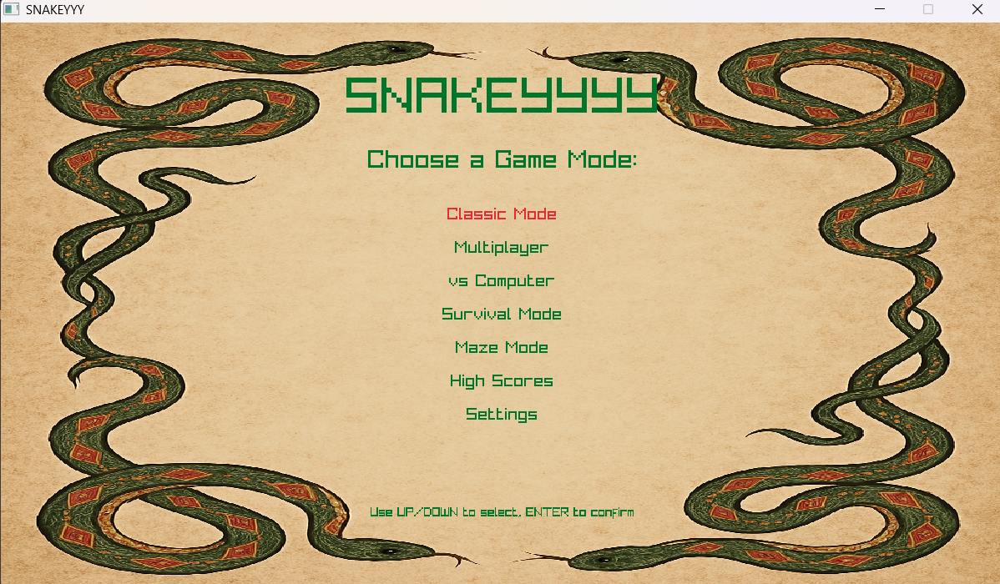
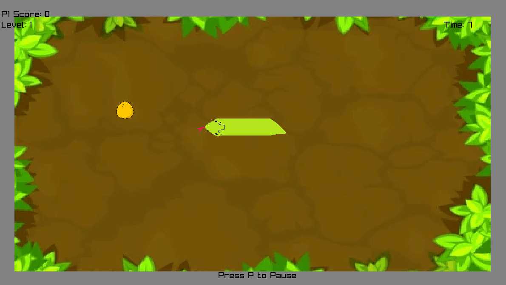

# SNAKEYYY - Advanced Snake Game

A feature-rich, modular Snake game **built entirely in C** using the Raylib framework. This project demonstrates the power of **pure C programming** to create a modern, polished arcade experience, highlighted by its **unique "Tactical Reverse" mechanic** that completely redefines the classic gameplay loop.


<p align="center">
  
  
</p>

## 🌟 Unique Feature: Tactical Reverse
Unlike traditional Snake games where reversing direction is a death sentence, **SNAKEYYY** introduces a strategic **Reverse Mechanic**.
*   **How it works**: You can instantly reverse your direction directly into your own body.
*   **The Cost**: Doing so is not free! You will sacrifice body segments and score points as you "consume" yourself to reverse.
*   **The Strategy**: Use this to escape 100% trapped situations, confuse opponents in multiplayer, or make impossible turns in the Maze mode. It turns a "Game Over" scenario into a "Costly Survival" choice.

## 🚀 Game Modes
*   **Classic Mode**: The traditional experience. Eat food, grow long, avoid walls.
*   **Multiplayer**: Local 1v1 battle. Outsmart your opponent or force them into a trap.
*   **vs Computer**: Practice your skills against an AI opponent.
*   **Survival Mode**: Bombs spawn over time. Survive as long as you can while the chaos increases.
*   **Maze Mode**: Navigate through complex wall patterns. Now features improved procedural alignment!

## 🛠️ Project Architecture
The project has been refactored into a professional C project structure for better maintainability and scalability:
*   **`src/`**: Modular source code (Entities, Game Loop, UI, etc.).
*   **`include/`**: Clean header configurations.
*   **`assets/`**: Organized media resources.

## 🎮 Controls
### Player 1
*   **Move**: Arrow Keys
*   **Reverse**: Press the opposite direction key (Consumes Score/Length!)

### Player 2
*   **Move**: W, A, S, D
*   **Reverse**: Press the opposite direction key

### General
*   **Pause**: P
*   **Main Menu**: M (from Pause screen)

## 📦 Building and Running
**Prerequisites**: GCC (MinGW) and Raylib.

### Compile
Run the following command from the project root:

```bash
gcc src/main.c src/globals.c src/utils.c src/resources.c src/storage.c src/entities.c src/ui.c src/game.c -Iinclude -o snake_game.exe -lraylib -lopengl32 -lgdi32 -lwinmm
```

### Run
```bash
./snake_game.exe
```

## 🤝 Contributing
Contributions are welcome! If you have ideas for new power-ups, game modes, or optimizations:
1.  **Fork** the repository.
2.  Create a new branch (`git checkout -b feature/NewFeature`).
3.  Commit your changes (`git commit -m 'Add some NewFeature'`).
4.  Push to the branch (`git push origin feature/NewFeature`).
5.  Open a **Pull Request**.

Suggestions for improvement:
*   Add more maze patterns.
*   Implement a network-based multiplayer mode.
*   Optimize the rendering loop for even lower spec hardware.

## 👥 Developers
*   **Dravid Ranjan**
*   **Guhanesh**
*   **Gopinath**

## 🏷️ Tags
`c` `raylib` `snake-game` `arcade` `multiplayer` `game-development` `procedural-generation` `retro` `survival-mode` `maze-game` `open-source`
